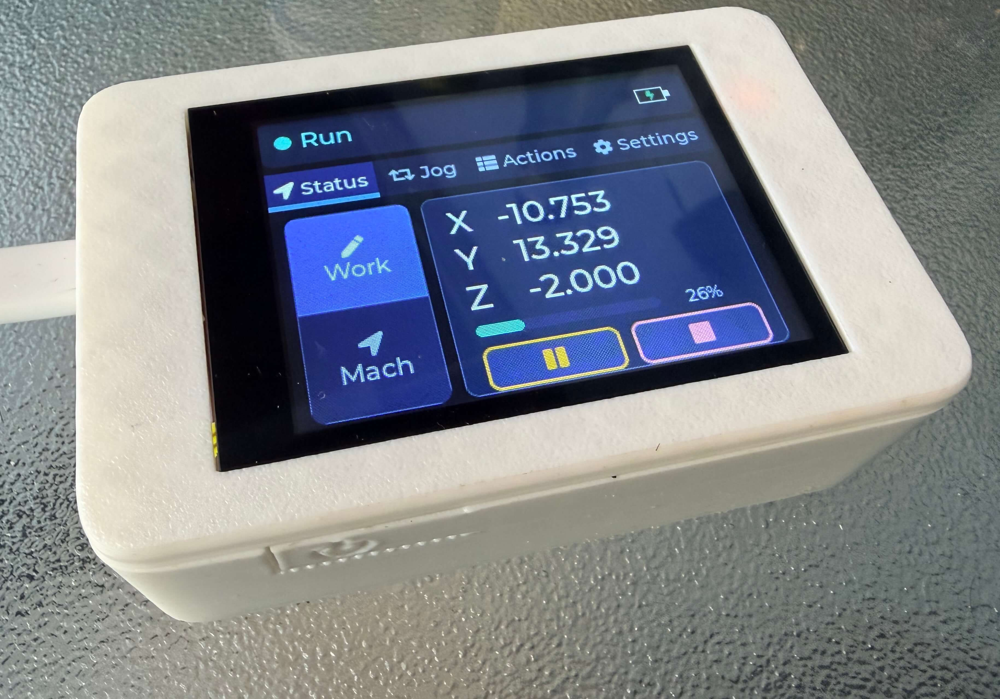

# FluidMonitor



FluidMonitor is a simple FluidNC DRO monitor and controller that runs on CYD-style ESP32 displays. It uses the [FluidNC-EspNow-Client](https://github.com/figamore/FluidNC-EspNow-Client) library for paired ESP-NOW transport and FluidNC status parsing, and provides status, jogging, and machine action controls.

## Web Installer

Flash FluidMonitor from Chrome or Edge with the **[FluidMonitor web installer](https://figamore.github.io/FluidMonitor/)**.

The installer also provides downloadable FluidNC `firmware.bin` builds from the ESP-NOW branch for ESP32 and ESP32-S3 controllers.

## FluidNC Requirement

FluidMonitor requires FluidNC with ESP-NOW support on the machine controller. ESP-NOW is not in an official FluidNC release yet, so until it is merged upstream your controller must run the [`feature/esp-now`](https://github.com/figamore/FluidNC/tree/feature/esp-now) branch.

You can install that controller firmware by downloading the matching ESP32 or ESP32-S3 `firmware.bin` from the [web installer](https://figamore.github.io/FluidMonitor/#fluidnc), then flashing it through the FluidNC web UI OTA update flow. You can also build the branch from source if you prefer.

## Build

```sh
pio run -e esp32-cyd
```

The firmware supports most capacitive and resistive CYD boards - but capacitive boards are largely preferred.

## Pairing

Open a 60 second ESP-NOW pairing window in FluidNC by sending `$espnow/pair` in the terminal (or by clicking the `Pair` button in the `ESP-NOW` section of [FigUI](https://github.com/figamore/FigUI)), then open the **Settings** tab in the app and tap **Pair**. Once paired, the app stores the machine profile and reconnects automatically.

## 3D Printed Case

Optional snap-fit cases are available on MakerWorld:

[FigCYD CYD case with optional battery](https://makerworld.com/en/models/2964422-figcyd-cyd-case-with-optional-battery#profileId-3323586)

Choose one of the two case styles from MakerWorld:

- **Slim case**: Powered by USB-C or 5V.

- **Battery case**: for a portable, fully-wireless build with an 18650 Li-Ion cell and holder.

## License

FluidMonitor is licensed under the GNU General Public License v3.0. See [`LICENSE`](LICENSE).
